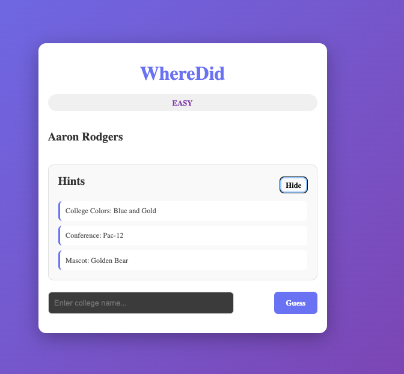

# WhereDid

A daily guessing game where players test their knowledge of NBA and NFL athletes.

## Overview

WhereDid is inspired by the classic game of asking friends "Where did they go to college?" and testing their knowledge of athletes' backgrounds. Our version turns that never-ending rabbit hole into a structured daily guessing game, challenging players to identify NBA and NFL athletes based on strategic hints about their careers and personal details.

Each day features a new mystery player that users must guess using strategic hints. The game features three difficulty levels to accommodate players of all knowledge levels.

## Screenshots




## Features

### Core Gameplay

- **Daily Mystery Player**: A new player is featured each day
- **Multi-League Support**: Players from both NBA and NFL
- **Multiple Difficulty Modes**:
  - **Easy Mode**: More generous hints and clues
  - **Medium Mode**: Balanced difficulty with moderate hints
  - **Hard Mode**: Challenging mode with minimal hints
- **Limited Guesses**: Players have a set number of attempts to guess correctly

### Planned Enhancements

- Score tracking and statistics
- Leaderboards
- Social sharing of results
- Streak tracking
- Player filtering by team, position, era, etc.
- Additional sports integration
- Mobile responsive design optimization

## Tech Stack

- **Frontend**: React 18 + TypeScript
- **Frontend Build Tool**: Vite
- **Frontend HTTP Client**: Axios
- **Backend**: FastAPI (Python)
- **Database**: MongoDB
- **Styling**: CSS3

## Getting Started

### Prerequisites

- Node.js 18+ (for frontend)
- Python 3.10+ (for backend)
- MongoDB 5.0+ (local or Atlas)
- npm or yarn (for package management)

### Running the Project

#### Start MongoDB

Make sure MongoDB is running:

```bash
# Local MongoDB (if installed)
mongod

# Or use MongoDB Atlas (update .env with your connection string)
```

#### Start Backend

From the `backend` directory:

```bash
uvicorn main:app --reload --host 0.0.0.0 --port 8000
```

The API will be available at `http://localhost:8000`
API documentation: `http://localhost:8000/docs`

#### Start Frontend

From the `frontend` directory:

```bash
npm run dev
```

The application will be available at `http://localhost:5173`

#### Build for Production

**Frontend**:

```bash
npm run build
```

**Backend**:

````bash
# Run with gunicorn or similar in production
gunicorn -w 4 -k uvicorn.workers.UvicornWorker main:app
```tup

1. Navigate to the backend directory:
   ```bash
   cd backend
````

2. Create a virtual environment:

   ```bash
   python -m venv venv
   ```

3. Activate the virtual environment:

   ```bash
   # On Windows
   venv\Scripts\activate

   # On macOS/Linux
   source venv/bin/activate
   ```

4. Install dependencies:
   ```bash
   pip install -r requirements.txt
   ```

## Project Structure

````
WhereDid/
├── frontend/                 # React + TypeScript frontend
│   ├── src/
│   │   ├── components/      # React components
│   │   ├── pages/           # Page components
│   │   ├── services/        # API service calls
│   │   ├── types/           # TypeScript type definitions
│   │   ├── styles/          # CSS files
│   │   ├── App.tsx
│   │   └── main.tsx
│   ├── index.html
│   ├── package.json
│   ├── tsconfig.json
│   ├── vite.config.ts
│   └── .eslintrc.cjs
│
├── backend/                  # FastAPI backend
│   ├── app/
│   │   ├── models/          # Pydantic models
│   │   ├── routes/          # API route handlers
│   │   ├── services/        # Business logic
│   │   └── db/              # Database connections
│   ├── main.py              # FastAPI app entry point
│   ├── requirements.txt
│   ├── .env.example
│   └── .gitignore
│
├── README.md
└── .gitignore
```vironment variables:
   ```bash
   cp .env.example .env
````

Update `.env` with your MongoDB connection string and other settings.

#### Frontend Setup

1. Navigate to the frontend directory:

   ```bash
   cd frontend
   ```

2. Install dependencies:

   ```bash
   npm install
   ```

3. Create a `.env.local` file (optional):
   ```bash
   VITE_API_URL=http://localhost:8000/api
   ```

### Running the Project

_To be updated_

## Game Rules

1. A random player from the NBA or NFL is selected as the daily mystery player
2. Players have a limited number of guesses to identify the correct player
3. Hints are provided based on difficulty level:
   - **Easy**: Basic information (team, position, jersey number, draft year)
   - **Medium**: Standard hints (team, position, statistics)
   - **Hard**: Minimal hints (limited identifying information)
4. Correct guess reveals the player's full profile and statistics
5. Results can be shared or tracked for daily streaks

## Project Structure

_To be updated_

## Contributing

_To be updated_

## License

_To be updated_

## Authors

- ilanHascal1237
- maxosorio

---

_Last updated: March 30, 2026_
